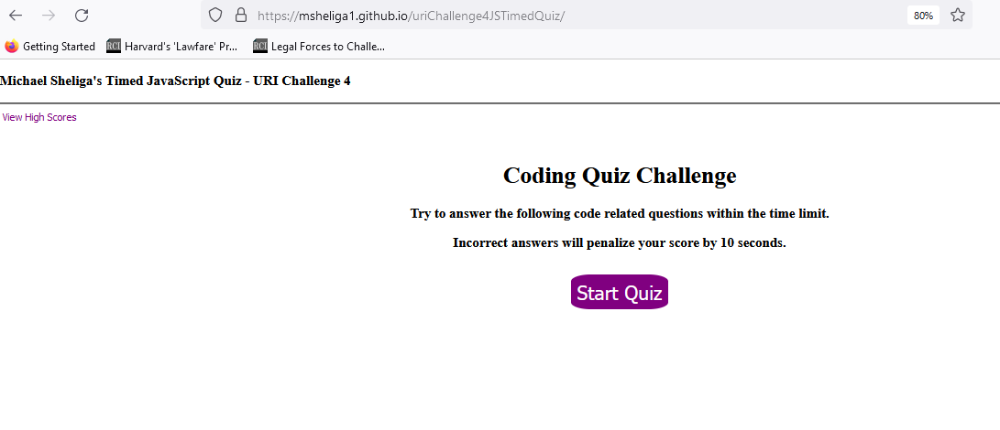
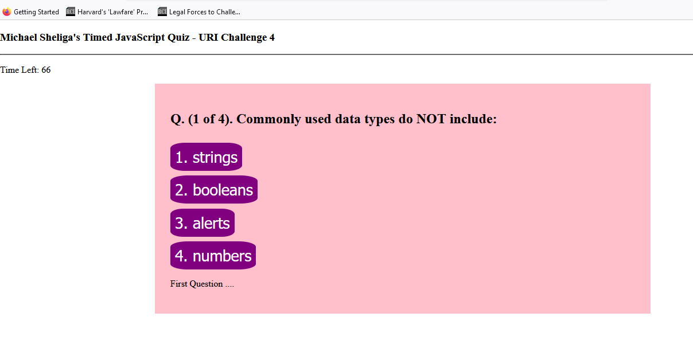

# uriChallenge4JSTimedQuiz
URI challenge 4 - Dynamic Javascript - Timed Quiz with Scores - MJS - Due 12.11.24

Michael Sheliga 12.9.23

This repo is for the University of Richmond (URI) coding bootcamp.  
This is the week 4 challenge due 12.11.23. 

## Link to Repo and Deployed Webpage
Link to GitHub Repo: https://github.com/msheliga1/uriChallenge4JSTimedQuiz.git
Here is a link to the deployed github.io site. https://msheliga1.github.io/uriChallenge4JSTimedQuiz/ 
Link to screenshot of deployed github.io site.  
Link to screenshot of deployed github.io site - Question.  

## Project Goals
In summary this repo will use dynamic javascript to create a timed multiple choice quiz with past scores.   
==============================================================================================================================   
Github:  
    Create Repo (github, repositories => New)  
    Clone to local machine (Copy https, then git clone paste)  
    Create a nice long READ.md file!!  (Modify prior projects.)  
    Copy directories and sample files from prior project (or create from scratch)
    -- Go to Demo (root) folder, download zip, moving to local repo, unzipping likely fastest method.     
    -- Could not find a quicker way to copy over all files.    
    ... create HTML and CSS ...  
    Commit and push files back to gitHub  
    Deploy code (Settings ... CA on left, GitHub Pages->main)  
        - Deployed code name on the right - maybe!!
    Make Sure it Works  
    Insert Screenshot of deployment into readme file.  
  
HTML, CSS and Javascript  
    View the Acceptance Criteria.  - Fuzzy as usual, especially in regards to showScores,
    Create/Modify HTML and CSS.   

    Acceptance Criteria

    click the start button: timer starts and I am presented with a question
    answer a question, presented with another question
    answer a question incorrectly, time (15) is subtracted from the clock
    all questions are answered or the timer reaches 0, game is over
    game is over, can save my initials and score

